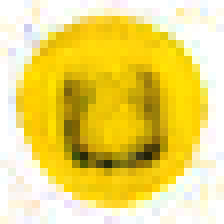
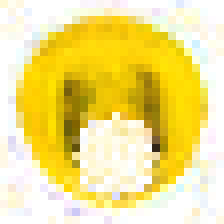
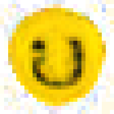

# 🧬 Neural Cellular Automata (C++ / WASM)

[日本語](README.md) | **English**

A Neural Cellular Automata (NCA) implementation where a picture **grows from a single "seed" cell** using nothing but a **learned neighbourhood rule (a tiny neural network)**, and **regrows itself (self-heals)** after part of it is erased.

Everything — from the training engine (a hand-written reverse-mode autograd) to inference (the WebAssembly demo) — is **pure C++ with no external dependencies**.

## 🎮 Live demos

Click / drag on the picture to **damage** it — it **regenerates** in a few dozen steps.

| Demo | Notes |
|------|-------|
| [😀 Smiley face](https://yomei-o.github.io/neural_ca/) | Trained on the target image built into the code |
| [🐱 Doraemon](https://yomei-o.github.io/neural_ca_dora/) | Example trained from an arbitrary image (`--target`) |

<p>
  
  
  
</p>

*Left: grown from a seed → Middle: damaged by a click → Right: self-healed*

## 💡 How it works

- Each cell holds a **16-dimensional state** (first 4 = premultiplied RGBA, the other 12 = hidden channels).
- **Perception**: fixed Sobel filters (identity / ∂x / ∂y) are convolved per channel to gather neighbourhood information (→ 3×C dims).
- **Rule**: the perception vector goes through a **small 2-layer MLP** (`3C → H → C`, ReLU) that outputs a state delta `Δstate`.
- **Update**: `state += Δstate` is applied to **every cell in parallel**, stochastically (50% per cell), followed by an **alive mask** that keeps only cells whose neighbourhood has enough alpha.
- Repeat for a few dozen steps and the global shape **emerges purely from the local rule**.

### Why self-healing can be learned

Training uses a **state pool + random damage**:

- Sample states from the pool, reset the worst one to a seed, and **deliberately punch a circular hole** into the good ones.
- Run T steps and minimise the MSE against the target image.
- This teaches both the **stability** to hold a shape and the **regeneration** ability to restore it after damage.

## 🛠 Build & train (CLI)

Trains on CPU and writes out the learned weights (`nca.bin`).

```bash
cmake -B build -DCMAKE_BUILD_TYPE=Release
cmake --build build --config Release

# Train the built-in smiley
./build/nca --iters 2000 --lr 2e-3 --out nca.bin

# Train on an arbitrary image (--target is a raw format: int w, int h, then w*h*4 premultiplied RGBA floats)
./build/nca --iters 2000 --target dora_target.raw --out dora.bin
```

Main options:

| Option | Description | Default |
|--------|-------------|---------|
| `--n`     | Grid side length | 28 |
| `--iters` | Training iterations | 2000 |
| `--lr`    | Learning rate (Adam) | 2e-3 |
| `--h`     | MLP hidden width | 128 |
| `--b`     | Batch size | 4 |
| `--tmax`  | Max steps per iteration | 64 |
| `--target`| Target image (raw format) | (built-in smiley) |
| `--out`   | Output weights file | nca.bin |

During training a `preview.ppm` is written every 200 iterations, and on exit it writes `grown.ppm` / `healed.ppm` (a grow → damage → heal demo). Example log:

```
iter    1 | T=46 | loss 0.08610
iter   25 | T=43 | loss 0.03983
...
iter 1600 | T=50 | loss 0.00731
```

## 🌐 Building the WASM demo

Embeds the trained `nca.bin` and builds with Emscripten.

```bash
# Point EMSDK at your install (default: /c/prog/emsdk/emsdk)
EMSDK=/path/to/emsdk NET=nca.bin OUT=wasmdist ./build_wasm_ca.sh
```

Drop `wasmdist/` (`ca.js` + `ca.wasm` + `index.html`) onto any static host and it runs.

## 📁 Layout

| File | Role |
|------|------|
| `autograd.h` / `autograd.cpp` | Dependency-free reverse-mode autograd engine (Tensor, conv2d, relu, Adam, …) |
| `nca.cpp` | Training program (pool + damage training, CLI) |
| `wasm_ca.cpp` | Inference-only runtime (no autograd), called from WASM |
| `build_wasm_ca.sh` | Emscripten build script |
| `CMakeLists.txt` | Build config for the CLI training binary |
| `wasmdist/` | Smiley WASM demo bundle |
| `wasmdist_dora/` | Doraemon WASM demo bundle |
| `*.bin` | Trained weights |
| `*.png` / `*.ppm` | Previews / screenshots |

## 📝 License / note

- The code and the smiley target image are original.
- The Doraemon demo is a **personal, local learning example** that illustrates the training mechanism. Rights to the character artwork belong to their respective owners.

## 🔗 Reference

- Mordvintsev et al., ["Growing Neural Cellular Automata"](https://distill.pub/2020/growing-ca/) (Distill, 2020) — the paper this implementation is inspired by.
